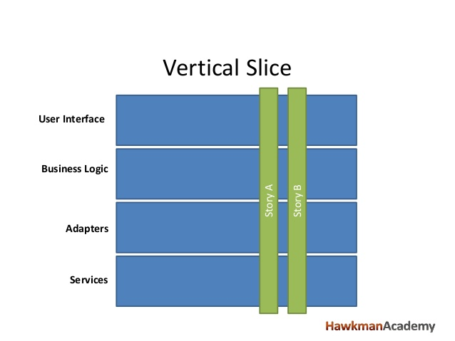
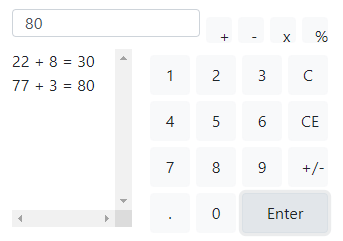
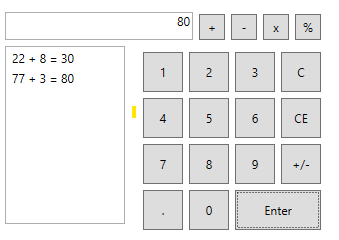

# wpf-blazor-porting

Small demonstrator showing porting WPF to Blazor (Web Assembly). In this demonstrator we:

* Ported a simple calculator
* Mimick the WPF XAML grid system, button, textbox and textlist as a Razor Components
* Translate these to wrap to Blazorize
* Slightly alter the WPF code behind and XAML for proper databinding.

## Side Notes

### Styling

*Note* We did not set a style-sheet for font and colors, font size in bootstrap is a bit bigger by default.
With some alterations, auto overflow/fontsize it will become pixel perfect.

### State management, vertical slicing & micro front ends.

Also notice the EventCallback differences, as well as Add.Item AddItem, Blazor needs more binding lambda's to bind to complex objects. This could also be achieved by Cascading Parameters. Or, more preferable, a good State and Mediator pattern that supports **vertical slicing** for **micro front ends.**
Such as **Blazor-State** from my friends at Timewarp Engineering. https://timewarpengineering.github.io/blazor-state/



### Front end, Code behind and Business Logic reuse

Front end and Code Behind reuse reaches well **over 90% reuse** differences are included in diffing reports.

Business Logic reuse (in this case Calc class instances) were **100% compatible** and therefore **not** included in diffing report.

### The original WPF application

Application is ported from Anna Pavlenko: https://github.com/apavlen WPF-Calculator

### Differences (standard Blazorise styling)

#### Blazor


#### WPF


### Diff between XAML/Razor

```diff
 <Grid Height="230" HorizontalAlignment="Left" Margin="0,31,0,0" Name="grid2" VerticalAlignment="Top" Width="328">
-    <TextBox Height="28" HorizontalAlignment="Left" Margin="6,0,0,196" Name="textBox1" VerticalAlignment="Bottom" Width="188" IsReadOnly="True" HorizontalContentAlignment="Right" />
-    <ListBox Height="178" HorizontalAlignment="Left" Margin="6,40,0,0" Name="listBox1" VerticalAlignment="Top" Width="120" />
+    <TextBox Height="28" HorizontalAlignment="Left" Margin="6,0,0,196" @ref="textBox1" VerticalAlignment="Bottom" Width="188" IsReadOnly="True" HorizontalContentAlignment="Right"></TextBox>
+    <ListBox Height="178" HorizontalAlignment="Left" Margin="6,40,0,0" @ref="listBox1" VerticalAlignment="Top" Width="120" />
     <Grid Height="26" HorizontalAlignment="Left" Margin="200,8,0,0" Name="grid4" VerticalAlignment="Top" Width="122">
         <Button Content="+" Height="26" Name="add" VerticalAlignment="Top" Margin="0,0,96,0" Click="add_Click" />
         <Button Content="-" Height="26" HorizontalAlignment="Left" Margin="32,0,0,0" Name="minus" VerticalAlignment="Top" Width="26" Click="minus_Click" />
         <Button Content="x" Height="26" HorizontalAlignment="Left" Margin="64,0,0,0" Name="multiple" VerticalAlignment="Top" Width="26" Click="multiple_Click" />
         <Button Content="%" Height="26" HorizontalAlignment="Left" Margin="96,0,0,0" Name="divide" VerticalAlignment="Top" Width="26" Click="divide_Click" />
     </Grid>
     <Grid Height="190" HorizontalAlignment="Left" Margin="137,40,0,0" Name="grid3" VerticalAlignment="Top" Width="190">
         <Button Content="1" Height="40" HorizontalAlignment="Left" Name="one" VerticalAlignment="Top" Width="40" Click="one_Click" Margin="7,6,0,0" />
         <Button Content="2" Height="40" HorizontalAlignment="Left" Margin="53,6,0,0" Name="two" VerticalAlignment="Top" Width="40" Click="two_Click" />
         <Button Content="3" Height="40" HorizontalAlignment="Left" Margin="99,6,0,0" Name="three" VerticalAlignment="Top" Width="40" Click="three_Click" />
         <Button Content="C" Height="40" HorizontalAlignment="Left" Margin="145,6,0,0" Name="clearentry" VerticalAlignment="Top" Width="40" Click="clear_Click" />
         <Button Content="4" Height="40" HorizontalAlignment="Left" Margin="7,52,0,0" Name="four" VerticalAlignment="Top" Width="40" Click="four_Click" />
         <Button Content="5" Height="40" HorizontalAlignment="Left" Margin="53,52,0,0" Name="five" VerticalAlignment="Top" Width="40" Click="five_Click" />
         <Button Content="6" Height="40" HorizontalAlignment="Left" Margin="99,52,0,0" Name="six" VerticalAlignment="Top" Width="40" Click="six_Click" />
         <Button Content="7" Height="40" HorizontalAlignment="Left" Margin="7,98,0,0" Name="seven" VerticalAlignment="Top" Width="40" Click="seven_Click" />
         <Button Content="8" Height="40" HorizontalAlignment="Left" Margin="53,98,0,0" Name="eight" VerticalAlignment="Top" Width="40" Click="eight_Click" />
         <Button Content="CE" Height="40" HorizontalAlignment="Left" Margin="145,52,0,0" Name="clear" VerticalAlignment="Top" Width="40" Click="clearentry_Click" />
         <Button Content="Enter" Height="40" HorizontalAlignment="Left" Margin="99,144,0,0" Name="enter" VerticalAlignment="Top" Width="86" Click="enter_Click" />
         <Button Content="9" Height="40" HorizontalAlignment="Left" Margin="99,98,0,0" Name="nine" VerticalAlignment="Top" Width="40" Click="nine_Click" />
         <Button Content="+/-" Height="40" HorizontalAlignment="Left" Margin="145,98,0,0" Name="sign" VerticalAlignment="Top" Width="40" Click="sign_Click" />
         <Button Content="." Height="40" HorizontalAlignment="Left" Margin="7,144,0,0" Name="decipoint" VerticalAlignment="Top" Width="40" Click="decipoint_Click" />
         <Button Content="0" Height="40" HorizontalAlignment="Left" Margin="53,144,0,0" Name="nil" VerticalAlignment="Top" Width="40" Click="zero_Click" />
     </Grid>
 </Grid>
```

### Diff between Code Behind

```diff
         static string defaultString = "0.0";
         string numberOneBuffer;
         string numberTwoBuffer;
         Calc c;
+        IText textBox1 { get; set; }
+        IItems listBox1 { get; set; }

-        public MainWindow()
+        protected override void OnAfterRender(bool firstRender)
         {
-            InitializeComponent();
-            c = new Calc();
-            textBox1.Text = defaultString;
+            if (firstRender)
+            {
+                textBox1.Text = defaultString;
+                c = new Calc();
                 numberOneBuffer = "";
                 numberTwoBuffer = "";
+            }
         }
 
-        private void one_Click(object sender, RoutedEventArgs e)
+        private void one_Click(MouseEventArgs e)
         {
+            Console.WriteLine("My debug output.");
             numberOneBuffer += "1";
             textBox1.Text = numberOneBuffer;
         }
 
-        private void two_Click(object sender, RoutedEventArgs e)
+        private void two_Click(MouseEventArgs e)
         {
             numberOneBuffer += "2";
             textBox1.Text = numberOneBuffer;
         }
 
-        private void three_Click(object sender, RoutedEventArgs e)
+        private void three_Click(MouseEventArgs e)
         {
             numberOneBuffer += "3";
             textBox1.Text = numberOneBuffer;
         }
 
-        private void four_Click(object sender, RoutedEventArgs e)
+        private void four_Click(MouseEventArgs e)
         {
             numberOneBuffer += "4";
             textBox1.Text = numberOneBuffer;
         }
 
-        private void five_Click(object sender, RoutedEventArgs e)
+        private void five_Click(MouseEventArgs e)
         {
             numberOneBuffer += "5";
             textBox1.Text = numberOneBuffer;
         }
 
-        private void six_Click(object sender, RoutedEventArgs e)
+        private void six_Click(MouseEventArgs e)
         {
             numberOneBuffer += "6";
             textBox1.Text = numberOneBuffer;
         }
 
-        private void seven_Click(object sender, RoutedEventArgs e)
+        private void seven_Click(MouseEventArgs e)
         {
             numberOneBuffer += "7";
             textBox1.Text = numberOneBuffer;
         }
 
-        private void eight_Click(object sender, RoutedEventArgs e)
+        private void eight_Click(MouseEventArgs e)
         {
             numberOneBuffer += "8";
             textBox1.Text = numberOneBuffer;
         }
 
-        private void nine_Click(object sender, RoutedEventArgs e)
+        private void nine_Click(MouseEventArgs e)
         {
             numberOneBuffer += "9";
             textBox1.Text = numberOneBuffer;
         }
 
-        private void zero_Click(object sender, RoutedEventArgs e)
+        private void zero_Click(MouseEventArgs e)
         {
             numberOneBuffer += "0";
             textBox1.Text = numberOneBuffer;
         }
 
-        private void decipoint_Click(object sender, RoutedEventArgs e)
+        private void decipoint_Click(MouseEventArgs e)
         {
             numberOneBuffer += ".";
         }
 
-        private void enter_Click(object sender, RoutedEventArgs e)
+        private void enter_Click(MouseEventArgs e)
         {
             string answer = "";
             if (c.isFirstOperation() || ((numberOneBuffer.Length > 0) && (numberTwoBuffer.Length > 0)))
             {
                 answer = c.operate(Convert.ToDouble(numberTwoBuffer), Convert.ToDouble(numberOneBuffer));
             }
             else
             {
                 answer = c.operate(Convert.ToDouble(numberTwoBuffer));
             }
 
             textBox1.Text = answer;
             updateList(answer);
             numberOneBuffer = "";
             numberTwoBuffer = "";
         }
 
         private void updateList(string answer)
         {
             string s = numberTwoBuffer;
 
             Calc.Operators op = c.getOperation();
             switch (op)
             {
                 case Calc.Operators.Addition:
                     s += " + ";
                     break;
                 case Calc.Operators.Subtraction:
                     s += " - ";
                     break;
                 case Calc.Operators.Multiplication:
                     s += " x ";
                     break;
                 case Calc.Operators.Division:
                     s += " % ";
                     break;
             }
 
             s += numberOneBuffer;
             s += " = ";
             s += answer;
-            listBox1.Items.Add(s);
+            listBox1.AddItem(s);
         }
 
-        private void sign_Click(object sender, RoutedEventArgs e)
+        private void sign_Click(MouseEventArgs e)
         {
             if (numberOneBuffer.Length > 0)
             {
                 if (numberOneBuffer[0] == '-')
                 {
                     numberOneBuffer = numberOneBuffer.Substring(1, numberOneBuffer.Length - 1);
                 }
                 else
                 {
                     numberOneBuffer = "-" + numberOneBuffer;
                 }
             }
             else
             {
                 numberOneBuffer = "-" + numberOneBuffer;
             }
             textBox1.Text = Convert.ToString(numberOneBuffer);
         }
 
-        private void clearentry_Click(object sender, RoutedEventArgs e)
+        private void clearentry_Click(MouseEventArgs e)
         {
             numberOneBuffer = "";
             textBox1.Text = defaultString;
         }
 
-        private void clear_Click(object sender, RoutedEventArgs e)
+        private void clear_Click(MouseEventArgs e)
         {
             numberOneBuffer = "";
             c.reset();
             textBox1.Text = defaultString;
         }
 
-        private void add_Click(object sender, RoutedEventArgs e)
+        private void add_Click(MouseEventArgs e)
         {
             if ((numberOneBuffer.Length > 0) && (numberTwoBuffer.Length > 0))
             {
                 string answer = c.operate(Convert.ToDouble(numberTwoBuffer), Convert.ToDouble(numberOneBuffer));
                 textBox1.Text = answer;
                 c.setOperation(Calc.Operators.Addition);
             }
             else
             {
                 c.setOperation(Calc.Operators.Addition);
                 numberTwoBuffer = numberOneBuffer;
                 numberOneBuffer = string.Empty;
             }
 
         }
 
-        private void minus_Click(object sender, RoutedEventArgs e)
+        private void minus_Click(MouseEventArgs e)
         {
             if ((numberOneBuffer.Length > 0) && (numberTwoBuffer.Length > 0))
             {
                 textBox1.Text = c.operate(Convert.ToDouble(numberTwoBuffer), Convert.ToDouble(numberOneBuffer));
             }
             c.setOperation(Calc.Operators.Subtraction);
             numberTwoBuffer = numberOneBuffer;
             numberOneBuffer = string.Empty;
         }
 
-        private void multiple_Click(object sender, RoutedEventArgs e)
+        private void multiple_Click(MouseEventArgs e)
         {
             if ((numberOneBuffer.Length > 0) && (numberTwoBuffer.Length > 0))
             {
                 textBox1.Text = c.operate(Convert.ToDouble(numberTwoBuffer), Convert.ToDouble(numberOneBuffer));
             }
             c.setOperation(Calc.Operators.Multiplication);
             numberTwoBuffer = numberOneBuffer;
             numberOneBuffer = string.Empty;
         }
 
-        private void divide_Click(object sender, RoutedEventArgs e)
+        private void divide_Click(MouseEventArgs e)
         {
             if ((numberOneBuffer.Length > 0) && (numberTwoBuffer.Length > 0))
             {
                 textBox1.Text = c.operate(Convert.ToDouble(numberTwoBuffer), Convert.ToDouble(numberOneBuffer));
             }
             c.setOperation(Calc.Operators.Division);
             numberTwoBuffer = numberOneBuffer;
             numberOneBuffer = string.Empty;
         }
 
         private string checkDecimal(string s)
         {
             if (s[s.Length - 1] == '.')
             {
                 s += "0";
             }
             return s;
         }
```
